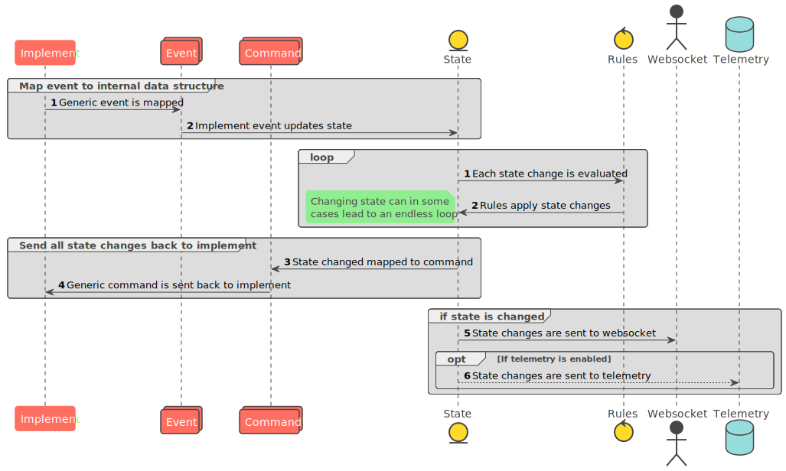
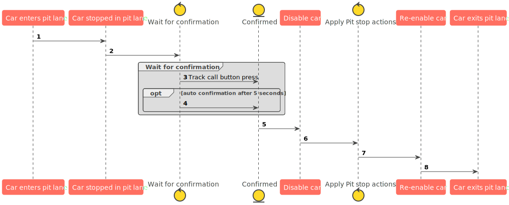

# OpenRMS
OpenRMS is an open platform for Slot car Race Management written in Go.

## Motivation
The motivation for starting this project is, my experience getting into
slot cars, and the software tooling around the hobby is for the most part
closed source, and in many cases unmaintained, platform dependent.

The idea is to create an open source race management system capable of
supporting multiple vendors such as Scalextric, Carrera or Oxigen.

Other than supporting as many vendors as possible, The community should
be extend OpenRMS with the features need, it could be better support for
Arduino, it could be having yellow flags light up around the track if a
car has crash.

Last it must be platform independent, the goal is to be able to run it
on a Raspberry Pi, eliminating the high entry price of a computer with
a Windows license. The goal is to release a version that will work on
both Mac OS, Linux and Windows

## Help Needed
I'm no expert in frontend development, I would like to ask the community
for any help with the frontend part of this project. Also if you have any
comments, suggestions on new features or changes or you want to help
extend openrms with support for other systems then Oxigen please let me
know.

## Getting Started
### Running OpenRMS
To get it running start by [downloading](https://github.com/qvistgaard/openrms/releases) the version that matches your platform.
Windows, Linux amd64 & arm (RapberryPi) is supported.

#### Windows
See detailed guide for windows [here](docs/getting-started/windows.md)

#### Linux
Linux does not require any dependencies, all you need to do is identify your Oxigen
dongle device name. to find the oxigen device simply plugin the dongle and execute
`dmesg` in a terminal, note: on some systems this requires elevated privileges, if
that is the case run `sudo dmesg` instead.
look for the following 4 log lines:

```
[   80.311293] usb 1-1: new full-speed USB device number 7 using xhci_hcd
[   80.461950] usb 1-1: New USB device found, idVendor=1fee, idProduct=0002, bcdDevice=10.00
[   80.461955] usb 1-1: New USB device strings: Mfr=0, Product=0, SerialNumber=0
[   80.463802] cdc_acm 1-1:1.0: ttyACM0: USB ACM device
```
the last line in the output example shows the device name `ttyACM0`. write the name down and 
edit the `config.yaml` file, find the `implement` section and change the `port` to 
`/dev/<devicename>`.

```
implement:
  plugin: oxigen
  oxigen:
    port: /dev/ttyACM0
```
now go to [running OpenRMS](#running-openrms).

### Building
To build run `make openrms`

### Running OpenRMS
When you have openrms build run `./openrms`. if you have want to set
a path for the configuration file set the `-config` flag: `./openrms -config <file>`

#### Configuration
Configuration is done via the config.yaml file. edit the file with the settings that matches your setup.

## Architecture
OpenRMS is build in a modular way, it's build around 3 different plugin
types:

- Implement
- Rule
- Telemetry

Messages are passed around each component using either events coming
from the `implement`, and commands sent to the `implement`.

Rules are then applied to each event, and each change made by a rule
is sent to the implement via a command. A rule can subscribe to individual
changes, and make changes to the state.

The full sequence diagram can be seen below:  


### Implement
The implement is the connector, this plugin type provides connectivity
between your hardware for example the Oxigen Dongle.

### Rule
The rule is the definition of rules which are in effect during a race.
for example fuel simulation

### Pit rules and process
The pit stop process is a little different from seen else where, for example
while the car is being "worked on" the car is disabled an unable to move. The
process does not start immediately, and the process can only be started once
each time the car enters the pit lane. Therefore, the pit stop must be confirmed
by not pressing the power lever and either pressing the track call/brake button 
for at least 1 second, or simply just wait for 5 seconds.  



### Telemetry
Optional plugin type which allows all metric collected to be shipped of
to a database like InfluxDB

## Extending

# Roadmap
- [ ] Web interface
  - [ ] Driver specific view
  - [ ] Race Marshall view
  - [ ] Leaderboard view *in progress*
- [X] Websocket Stream
- [X] Time keeping
- [X] Lap counting
- [X] Individual car settings
  - [X] Max speed
  - [X] Min speed
  - [X] Pit speed
- [X] Limb mode plugin
- [ ] Pit handling, refuelling, repairs, etc *in progress*
- [ ] Fuel simulation *in progress*
- [ ] Damage simulation
- [ ] Tire wear simulation
- [ ] Race planning
- [X] Better logging with configurable log levels
- [X] Race management plugin support
- [X] External metric storage
  - [X] InfluxDB

# Contributing
When contributing to this repository, please first discuss the change you wish to make via issue,
email, or any other method with the owners of this repository before making a change.

Please note we have a code of conduct, please follow it in all your interactions with the project.

## Pull Request Process

1. Ensure any install or build dependencies are removed before the end of the layer when doing a
   build.
2. Update the README.md with details of changes to the interface, this includes new environment
   variables, exposed ports, useful file locations and container parameters.
3. Increase the version numbers in any examples files and the README.md to the new version that this
   Pull Request would represent. The versioning scheme we use is [SemVer](http://semver.org/).
4. You may merge the Pull Request in once you have the sign-off of two other developers, or if you
   do not have permission to do that, you may request the second reviewer to merge it for you.

# License
OpenRMS is licensed under the Apache License, Version 2.0. See LICENSE for
the full license text.
