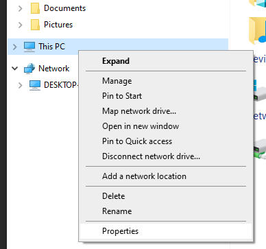
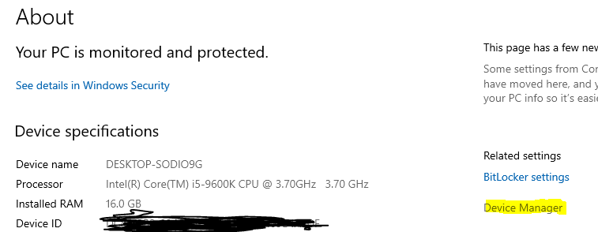
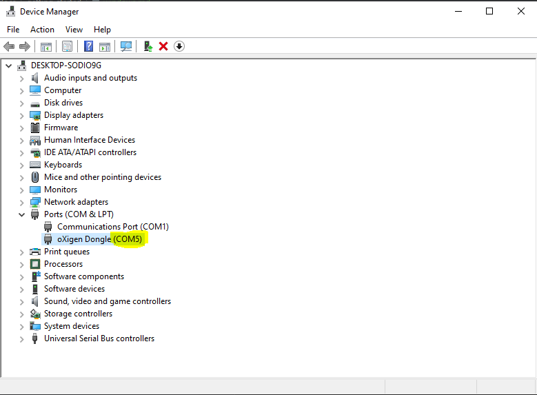

# Running OpenRMS on Windows
Before you start this guide, make sure you have the Oxigen device drivers installed as
describe in [Slot.it's driver install guide](http://slot.it/oxigen/#1558954518560-fda67f59-141e)

## Locating the Device name
1. Start by opening "My computer" or "Files", and right-click the `This PC` icon and click `Properties`
   

2. The locate the `Device Manager` link to the right, click the link.
   

3. Locate you Oxigen dongle and take note of the COM port it should be listed as `COMx`.
   

## Configure OpenRMS
edit the `config.yaml` file, find the `implement` section and change the `port` to
`COM<deviceId>`.

```
implement:
  plugin: oxigen
  oxigen:
    port: COM5
```
now go to [running OpenRMS](#running-openrms).

## Running OpenRMS
First download the windows binary and extract the zip file, then put .exe file anywhere you like. next download
the [default config file](https://raw.githubusercontent.com/qvistgaard/openrms/main/config.yaml) and save it
in the same location. then change the configuration as described above, then run the openrms exe file.

### Troubshooting
if the window closes immediately, inspect the Openrms log file for any errors. 